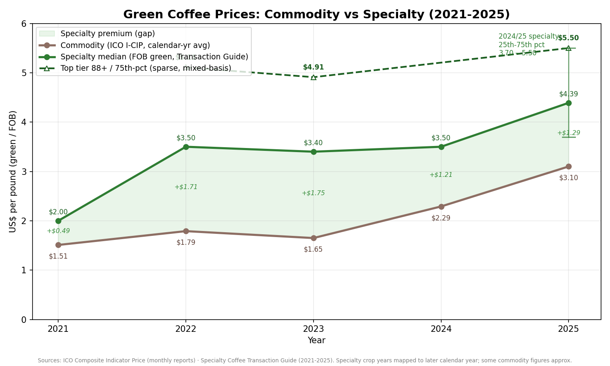

# TEMP Research Structure

### Finca Duna / Sun Nation — Regenerative Coffee Thesis

-----

## 0. How to use this document

This is the working map for the research phase. Each **node** below is owned by one person, researched independently, and written up as a “temporary slide” — exploratory, not polished. We then run a synthesis pass to compress everything into the minimal presentation.

**North star (do not lose this):**

> The goal is a *minimal coherent presentation that justifies the coffee farm* — not an explanation of the entire civilization thesis at once. The farm is the demonstration node. Research that doesn’t help justify the farm is appendix or Phase 2.

Every node owner should keep asking: *does this help an investor say yes to the farm, or is it vision/upside?*

**Why this matters:** A modular research architecture allows the team to explore complex regenerative systems without losing strategic clarity or execution focus.

-----

## 1. The strategic fork (decide early — it reshapes every node)

The whole project resolves to one of two postures. Research feeds this decision; it is not a separate research node.

|             |**Option A — Simple Farm**                 |**Option B — Regenerative Coffee Platform**                            |
|-------------|-------------------------------------------|-----------------------------------------------------------------------|
|Scope        |Farm only; sell to “John”; learn operations|Warehouse, processing, export, coffee fund, regional purchasing network|
|Risk / upside|Lower / lower                              |Higher / higher                                                        |
|Capital ask  |Smaller                                    |Larger                                                                 |
|Narrative    |“Foundational regenerative pilot”          |“Regional regenerative transformation platform”                        |

**Why this matters:** The decision between a focused farm pilot and a regional regenerative platform determines the project’s complexity, funding needs, operational burden, and long-term trajectory.

**Action:** Capital and Coffee nodes (Tier 1) should each produce findings for *both* options so leadership can pick the posture before final synthesis.

-----

## 2. Standard node brief (every owner fills this in)

Copy this template per node. Keep it to ~1 page.

```
NODE: [name]
OWNER: [person]
TIER: [1 / 2 / 3]

1. CORE QUESTION  — the single thing this node must answer
2. KEY SUB-QUESTIONS — 3–6 bullets
3. DATAPOINTS TO GATHER — concrete numbers/sources needed
4. DECISION IT INFORMS — what choice this research unblocks
5. PHASE — Phase 1 (now) / Phase 2 (expansion)
6. VISUALS / EVIDENCE — what to collect for the slide
7. OPEN UNKNOWNS / RISKS
```

-----

## 3. The node map (tiered by priority)

**Tier 1 — Must answer to justify the farm.** These carry the funding decision.
**Tier 2 — Strengthens the case / differentiation.**
**Tier 3 — Vision & expansion.** Mostly appendix or Phase 2.

|Tier|Node                                |Owns the question of…                                       |
|----|------------------------------------|------------------------------------------------------------|
|1   |Capital Stack & Finance             |Can this be financed and return capital?                    |
|1   |Specialty Coffee (anchor)           |Is there a premium, sellable product?                       |
|1   |Soil & Regenerative Agronomy        |Is the production base viable and improving?                |
|1   |Water Systems                       |Is there enough water, sustainably?                         |
|1   |Processing & Facility               |Can we produce export-quality coffee reliably?              |
|2   |Solar & Energy Infrastructure       |Can operations run low-carbon / off-grid?                   |
|2   |Labor & Intercultural Coordination  |Who does the work, fairly and durably?                      |
|2   |Agroforestry & Local Distribution   |What else does the land produce / circulate?                |
|2   |Partnerships                        |Who de-risks and accelerates this?                          |
|3   |Ancestral / Cosmological Practices  |What makes this deeply differentiated?                      |
|3   |Media & Narrative                   |How does this become globally visible?                      |
|3   |Tourism, Education & Healing        |What experience-economy revenue exists?                     |
|3   |Governance & Tokenomics             |How does value recirculate bioregionally?                   |
|3   |Regen Tech (MRV / Web3 / AI / Infra)|What measurement & coordination layer enables credits/trust?|

-----

## 4. Node briefs

### TIER 1 — Decision-driving

**Capital Stack & Finance**

- **Why this matters:** Capital structure determines whether the project can survive long enough to regenerate the land while remaining economically viable and scalable.
- **Core question:** What’s the right ask, structure, and return timeline — for Option A and Option B?
- **Sub-questions:** Ask size? Ticket sizes? Blend of catalytic / patient / operating capital? Revenue timelines? Risk profile? Warehouse ROI? Margin expansion path?
- **Datapoints:** Acquisition + setup costs, operating burn, revenue ramp by year, warehouse ROI model, comparable raises in specialty coffee / regen ag.
- **Informs:** The funding ask itself + Option A vs B decision.
- **Phase:** Both. Phase 1 = acquisition/infra/operating; Phase 2 = warehouse, coffee fund, regional purchasing.

**Specialty Coffee (anchor product)**

- **Why this matters:** Specialty coffee is the economic engine that transforms regeneration from an ideal into a premium, revenue-generating product.
- **Core question:** Is there a defensible premium product with a buyer?
- **Sub-questions:** Flavor profile and cupping potential? Market positioning? Export markets and channels? Roast partnerships? Premium vs. commodity spread?
- **Datapoints:** Current market + specialty premiums, processing methods used, yield quality, existing/likely buyers.
- **Informs:** Revenue model and pricing assumptions feeding Capital node.
- **Phase:** 1.

**Soil & Regenerative Agronomy**

- **Why this matters:** Soil health is the biological foundation of long-term productivity, ecological resilience, and regenerative credibility.
- **Core question:** What condition is the soil in, and what’s the realistic restoration trajectory?
- **Sub-questions:** Composition? Degradation level? Organic matter %? Carbon sequestration potential? Shade coverage? Restoration timeline?
- **Datapoints:** Soil tests, erosion conditions, existing fertility, restoration timeline. Methods to evaluate: bokashi, biofertilizers, compost tea, cover crops, fungal systems, agroforestry integration.
- **Informs:** Yield assumptions, transition costs, regen credibility, and any future carbon/biodiversity credit claims.
- **Phase:** 1 (assessment), 1–2 (implementation).

**Water Systems**

- **Why this matters:** Reliable and intelligent water stewardship determines operational stability, ecological sustainability, and processing quality.
- **Core question:** Is there reliable water for processing and operations, with rights secured?
- **Sub-questions:** Spring sources? Gravity-fed potential? Water rights status? Conservation methods? Processing water per kg?
- **Datapoints:** Source mapping, seasonal flow, rain-collection viability, water use per kg coffee, greywater reuse options.
- **Informs:** Processing design and regulatory/operational risk.
- **Phase:** 1. **Potential partner:** Del Agua.

**Processing & Facility**

- **Why this matters:** Operational excellence increases quality, reduces waste, preserves value, and turns regeneration into measurable economic advantage.
- **Core question:** Can we reliably produce export-grade, traceable coffee?
- **Sub-questions:** Fermentation / washing / drying setup? Sorting (incl. optical / AI-assisted)? Facility cost? Loss reduction? Labor efficiency?
- **Datapoints:** Facility costs, yield preservation %, water efficiency, loss reduction %.
- **Informs:** Quality + cost assumptions, and the Option B warehouse/processing case.
- **Key insight to carry forward:** *operational excellence is itself a regenerative advantage* (less waste, higher value per unit input).
- **Phase:** 1 (basic), 2 (expansion).

-----

### TIER 2 — Strengthens the case

**Solar & Energy Infrastructure**

- **Why this matters:** Energy sovereignty lowers operational risk, reduces carbon dependency, and demonstrates regenerative infrastructure in practice.
- **Core question:** Can operations (especially drying) run off-grid / low-carbon at acceptable cost?
- **Datapoints:** Annual sunlight hours, solar panel ROI, coffee-drying energy needs, battery sizing, solar pump feasibility, current electrical limitations.
- **Informs:** Capex, operating cost, “energy sovereignty” narrative.
- **Phase:** 1–2.

**Labor & Intercultural Coordination**

- **Why this matters:** The project succeeds or fails based on its ability to create durable, fair, and culturally aligned systems of human collaboration.
- **Core question:** What does fair, durable, intercultural regenerative labor look like here?
- **Sub-questions:** How do Arhuaco, Colombian, Venezuelan, and international participants collaborate? How is indigenous sovereignty preserved? What governance is needed? Seasonal worker dynamics? Housing? Fair pay?
- **Datapoints:** Existing local labor structures, pay structures, housing requirements, knowledge-transfer methods.
- **Informs:** Operating cost, social-license / ESG credibility, and the governance node.
- **Phase:** 1.

**Agroforestry & Local Distribution**

- **Why this matters:** Diversified land outputs and local circulation strengthen regional resilience and reduce dependence on extractive monoculture economics.
- **Core question:** What does the land produce beyond coffee, and how does it circulate locally?
- **Current outputs:** coffee, plantains, citrus, garden products, cattle. **Future:** expanded agroforestry, medicinal plants, native species.
- **Local distribution:** food systems, energy/internet sharing, community access, market relationships.
- **Informs:** Diversified revenue + bioregional multiplier story.
- **Phase:** 1 (existing), 2 (expansion).

**Partnerships**

- **Why this matters:** Strategic partnerships accelerate execution, reduce risk, provide credibility, and expand operational capability beyond the core team.
- **Core question:** Who de-risks, validates, or accelerates each node?
- **Candidates:** Del Agua (water), Rainforest Alliance, Regenerates.co, specialty coffee operators, indigenous cooperatives, solar providers, carbon-credit groups.
- **Informs:** Credibility slide + reduced execution risk.
- **Phase:** 1.

-----

### TIER 3 — Vision & expansion (appendix / Phase 2)

Keep these *light* for the minimal presentation — one strong slide or appendix each. They are differentiation and upside, not the core justification.

**Ancestral / Cosmological Practices** — Mamo ceremonial systems, lunar/planting cycles, ecological timing, spiritual governance. *The “deep intelligence” differentiator.* Research: seasonal indigenous practices, timing methodologies, oral ecological knowledge. Handle with cultural sensitivity and Arhuaco consent.
*Why this matters:* Ancestral ecological knowledge introduces long-duration stewardship systems that differentiate the project beyond conventional sustainability models.

**Media & Narrative** — Existing assets: media studio, nature studio, documentary/YouTube potential. Research: brand identity, documentary strategy, educational media, global positioning.
*Why this matters:* Narrative infrastructure transforms the farm from an isolated project into a globally visible symbol of regenerative possibility.

**Tourism, Education & Healing** — Eco-lodges, retreats, cultural/educational immersion, nature-based healing and nervous-system restoration, apprenticeships. Research: retreat design, demand, pricing.
*Why this matters:* Experiential outputs create diversified revenue while allowing people to directly participate in regeneration, learning, and restoration.

**Governance & Tokenomics** — Revenue recirculation, collective governance, Arhuaco participation, bioregional treasury, regenerative economics. Frame as the long-term coordination layer.
*Why this matters:* Governance systems determine how value circulates, who benefits, and whether regeneration compounds across the bioregion over time.

**Regen Tech (MRV / Web3 / AI / Infra)** —

- *MRV:* carbon + biodiversity tracking, supply-chain transparency (also underpins credit revenue).
- *Web3:* coffee traceability, provenance, regen-finance rails.
- *AI:* ecological optimization, supply-chain intelligence, forecasting, media generation.
- *Infra:* connectivity, sensors, rural compute, distributed systems.

*Why this matters:* Regenerative technology creates transparency, coordination, measurement, and trust layers that enable scalable regenerative operations and future financial mechanisms.

-----

## 5. Workflow & synthesis

**Step 1 — Assign nodes.** One owner per node; Tier 1 nodes get the most senior/experienced people.

**Step 2 — Build temporary slides.** Exploratory, context-gathering, internal education. Not final quality. Use the standard brief.

**Step 3 — Synthesis pass.** For every node ask:

- What’s investor-relevant *for justifying the farm*?
- What’s Phase 1 vs Phase 2?
- What becomes appendix?
- What’s operational-later (park it)?

**Step 4 — Minimal coherent presentation.** Assemble only what justifies the regenerative coffee node. Everything else → appendix or backlog.

> **Why this matters:** The ability to compress complexity into a clear, fundable narrative is what transforms visionary systems into executable reality.

**Synthesis filter (apply to every slide):** *Does this move an investor toward yes on the farm?* If no → appendix or Phase 2.

-----

## 6. Core thesis to keep visible throughout

> “This is a micro reality condensing our macro reality into one project.”

The farm is a compressed prototype and a gateway: governance, energy, finance, culture, technology, labor, education, media, and regeneration condensed into one operational reality — but pitched, for now, as one fundable coffee farm.

-----

## 7. Online data sources by node (research starting points)

This section maps each node to concrete, mostly-free online sources where the team can gather the datapoints called for above. Treat it as a starting map, not an exhaustive list. Three working notes:

- **Tier the sourcing the same way we tier the nodes.** Spend the most effort getting hard numbers for Tier 1 (these carry the funding decision). For Tier 3, a few credible reference points are enough.
- **Prefer primary / institutional sources over secondary summaries.** Government agencies (FNC, IDEAM, IGAC), multilaterals (World Bank, FAO), and standard-setters (Verra, Rainforest Alliance, SCA) are citable in an investor deck; blogs and market-research press releases are not — use the latter only to find the underlying study.
- **Localize everything to the Sierra Nevada de Santa Marta (SNSM) / Magdalena–La Guajira context where possible.** National averages are a fallback; site- or region-specific data is far more persuasive.

### TIER 1 — Decision-driving

**Capital Stack & Finance**

- **Comparable raises / benchmarks:** Crunchbase, PitchBook (paywalled), and AgFunder’s annual *AgriFoodTech Investment Report* for regen-ag and specialty-coffee deal sizes and structures.
- **Blended/catalytic capital models:** Convergence Finance (blended finance deal database), Root Capital and responsAbility (agricultural lending terms), IDB Invest and IFC (development-bank ag financing in Latin America).
- **Cost/revenue baselines:** FNC and USDA FAS GAIN reports (Colombian coffee economics); World Bank commodity *Pink Sheet* for long-run price series feeding revenue models.
- **Caveat:** treat any single comparable as indicative; build the model from a range and state assumptions explicitly.

**Specialty Coffee (anchor product)**

- **Price benchmarks:** [ICO Composite Indicator Price (I-CIP) and public market data](https://ico.org/resources/public-market-information/) for the commodity floor; the [Specialty Coffee Transaction Guide](https://www.transactionguide.coffee/reports) for *actual* green specialty transaction prices by quality score — this is the single best source for the premium-vs-commodity spread.
- **Quality/standards:** [Specialty Coffee Association (SCA)](https://sca.coffee) cupping protocols and scoring; Coffee Quality Institute (Q-grader scores) for what a given cupping score is worth.
- **Origin/market context:** FNC ([federaciondecafeteros.org](https://federaciondecafeteros.org/?lang=en)) for Colombian production, exports, and the FoNC reference price; USDA FAS for export-market demand.
- **Buyers/channels:** roaster transparency reports (e.g. Counter Culture, Onyx, Tim Wendelboe) publish prices paid — useful for realistic buyer expectations and direct-trade benchmarks.

**Soil & Regenerative Agronomy**

- **Baseline soil maps (desk study before field tests):** [ISRIC SoilGrids](https://isric.org/explore/soilgrids) (global, 250 m, organic carbon / pH / texture by depth); Colombia’s **IGAC** soil information service (SIGA, 1:100,000 mapping units and representative profiles) for national-scale detail.
- **Carbon/regen baselines & methods:** FAO (GSOC map, RECSOIL), CIAT / Alliance of Bioversity & CIAT (tropical agroforestry and Colombian coffee agronomy research).
- **Hard truth:** desk sources establish *context and trajectory*; defensible yield and credit claims require **on-site soil tests** — budget for them in Phase 1.

**Water Systems**

- **Hydrology / rainfall:** [IDEAM](https://www.un-spider.org/colombia-institute-hydrology-meteorology-and-environmental-studies-ideam) (Colombia’s hydrology & meteorology institute) for station data, flows, and precipitation; the [CGIAR post-processed SNSM climate dataset](https://www.cgiar.org/research/publication/post-processed-climate-dataset-sierra-nevada-de-santa-marta-snsm-region-colombia/) (1 km precipitation, temperature, PET) is purpose-built for this exact region.
- **Water rights / regulation:** CORPAMAG (regional environmental authority for Magdalena) and ANLA for concession and permitting rules.
- **Processing water footprint:** SCA / published wet-mill studies and Rainforest Alliance water criteria for litres-per-kg benchmarks and greywater/eco-pulping options.
- **Note:** spring flow and seasonality ultimately need on-site measurement; remote data sizes the question.

**Processing & Facility**

- **Equipment & method specs:** manufacturer data (Penagos, Pinhalense for wet/dry mills; optical sorters from Bühler/Cimbria) for capex and throughput; SCA and Perfect Daily Grind / *Coffee Research* for process trade-offs (washed/honey/natural, drying, fermentation control).
- **Loss/yield benchmarks:** published green-coffee outturn and defect-loss figures from FNC technical guides and academic wet-milling studies.
- **Traceability/compliance:** **EU Deforestation Regulation (EUDR)** guidance — increasingly a hard requirement for export-grade traceability and a selling point for Option B.

### TIER 2 — Strengthens the case

**Solar & Energy Infrastructure**

- **Solar resource:** [Global Solar Atlas](https://globalsolaratlas.info/download) (World Bank/Solargis) — free GHI/PVOUT GeoTIFFs and site PDF reports for the exact coordinates; NASA POWER for long-run irradiance/temperature series.
- **Drying energy needs:** published coffee-drying thermal/energy studies and equipment datasheets (mechanical vs solar/parabolic dryers).
- **Costs:** IRENA *Renewable Power Generation Costs* and NREL benchmarks for panel/battery/pump cost curves; local installer quotes for grounding.

**Labor & Intercultural Coordination**

- **Wage / labor structure:** Colombia’s DANE (labor statistics, rural wages) and Ministerio del Trabajo (minimum wage, rural labor law).
- **Fair-labor frameworks:** ILO conventions, Fairtrade and Rainforest Alliance labor criteria for "fair and durable" benchmarks.
- **Indigenous sovereignty:** ONIC and CIT (Confederación Indígena Tairona) for Arhuaco governance context; ILO Convention 169 / Colombia’s *consulta previa* (prior-consultation) law — essential for getting the social-license framing right and respectful.

**Agroforestry & Local Distribution**

- **Species & systems:** CIAT/CIPAV and World Agroforestry (ICRAF) for shade-coffee and agroforestry species, yields, and design; FAO for diversified-output data.
- **Local market/food-system context:** DANE agricultural census and Colombia’s SIPSA (price/supply system) for what diversified outputs can fetch locally and regionally.

**Partnerships**

- **Validate candidates directly:** [Rainforest Alliance](https://www.rainforest-alliance.org/coffee/) (note the new **Regenerative Agriculture Standard, effective March 2026** — directly relevant), Del Agua, Regenerates.co — pull each org’s published criteria, reports, and case studies.
- **Find adjacent partners:** Regen Network, Savory Institute / Land to Market, and specialty-coffee importer directories (e.g. SCA membership) for de-risking and credibility partners.

### TIER 3 — Vision & expansion (keep light)

**Ancestral / Cosmological Practices** — Academic/ethnographic sources only, handled with care and Arhuaco consent: peer-reviewed work on SNSM indigenous ecological knowledge (e.g. Frontiers in Climate, ScienceDirect studies on SNSM), ONIC/CIT materials. Do **not** treat sacred knowledge as a "datapoint" to be scraped — source ethically and with permission.

**Media & Narrative** — Industry benchmarks from documentary/impact-media case studies; YouTube/Patreon creator economics; B-Corp and regen-brand storytelling examples. Mostly qualitative.

**Tourism, Education & Healing** — [Grand View Research / market reports](https://www.grandviewresearch.com/industry-analysis/ecotourism-market-report) for ecotourism market size and growth (use the figures, cite the underlying report); ANATO and ProColombia for Colombia-specific ecotourism demand; comparable retreat/eco-lodge pricing from operator websites. Treat market-research press numbers as directional.

**Governance & Tokenomics** — Regen Network, Celo / ReFi ecosystem docs, and academic regenerative-economics literature; existing bioregional-treasury and cooperative case studies. Conceptual at this stage.

**Regen Tech (MRV / Web3 / AI / Infra)** —

- *MRV / credits:* [Verra (VCS, incl. VM0042 soil/ag methodology)](https://www.green.earth/news/verra-updates-soil-carbon-methodology-for-clearer-reporting) and [Gold Standard](https://globalgoals.goldstandard.org) for carbon/biodiversity credit methodologies and pricing — these double as the Soil node’s credit-revenue evidence.
- *Web3 / traceability:* Regen Network, Toucan, and coffee-provenance pilots for traceability rails.
- *Connectivity/sensors:* commercial IoT/LoRaWAN and satellite-connectivity (e.g. Starlink) specs and costs for rural-compute feasibility.

**Cross-cutting (feeds the Strategic Fork and Capital):** World Bank commodity *Pink Sheet*, FAOSTAT, and OEC (Observatory of Economic Complexity) for trade flows — useful background for both Option A and Option B framing.

-----

## 8. Global coffee price trend, last 5 years (feeds the Specialty Coffee + Capital nodes)

**What this is:** the **ICO Composite Indicator Price (I-CIP)** — the industry’s standard world reference price for green (unroasted) coffee, published by the International Coffee Organization in US cents per pound. This is the **commodity baseline**. Specialty coffee — what Finca Duna would sell — trades at a **premium above** this line (see the takeaway below). Use it to show market direction, not as our expected sale price.

### Calendar-year averages (US¢/lb)

| Year | I-CIP avg (¢/lb) | ≈ US$/lb | Direction & notes |
|------|------------------|----------|-------------------|
| 2021 | ≈ 151 *(approx.)* | ≈ $1.51 | Sharp climb through the year: ~119¢ (Feb) → 203¢ (Dec) on frost/drought in Brazil. |
| 2022 | ≈ 179 *(approx.)* | ≈ $1.79 | Peaked ~210¢ mid-year, eased to 157¢ by December. |
| 2023 | **165** *(confirmed)* | $1.65 | Range-bound year; ICO 12-month average 165.23¢ (Dec 2023). |
| 2024 | **229** *(confirmed)* | $2.29 | Up ~40% YoY; ICO: “I-CIP closes 2024… averaging 229.34¢/lb.” Closed Dec near 299¢. |
| 2025 | ≈ 310 *(est., record yr)* | ≈ $3.10 | All-time highs: Feb 354.32¢ (highest monthly avg on record); Dec 304.68¢. |
| 2026 (YTD) | ~266–274 | ~$2.66–2.74 | Mar 273.70¢, Apr 266.24¢ — easing from 2025 peak but still historically very high. |

*Confirmed = stated directly in ICO monthly reports. Approx./est. = reconstructed from ICO monthly figures where ICO did not publish a single headline annual average; treat the ≈ values as indicative, verify exact figures from the ICO Excel series ([stats@ico.org](mailto:stats@ico.org)) before putting them in an investor deck.*

### The trend in one line

Green coffee **roughly doubled** from ~$1.51/lb (2021) to ~$2.29/lb (2024), then spiked to an **all-time record in 2025** (~$3.10/lb avg, $3.54 peak in Feb), and is **easing modestly in 2026** while staying near historic highs. Drivers: repeated Brazil/Vietnam supply shocks (frost, drought), low global stocks, and currency moves.

### The takeaway that matters for the farm

- **This is the commodity floor, not our price.** Specialty coffee sells *above* the I-CIP. In Q1 2026, specialty retail prices rose 3.9% while commodity prices fell 7.2% — specialty is structurally **decoupling upward** from the commodity market.
- **Colombian Milds trade above the composite.** Colombia’s washed Arabica is its own (higher) ICO group indicator — our regional baseline is above the world composite.
- **For the deck, layer two lines:** (1) this I-CIP commodity trend, and (2) actual specialty green prices for comparable cup scores from the [Specialty Coffee Transaction Guide](https://www.transactionguide.coffee/reports). The gap between them *is* the regenerative/specialty premium thesis.

### Specialty overlay — the premium thesis (commodity vs specialty)

The commodity line above is the *floor*. The chart below overlays it with **specialty median FOB green prices** from the Specialty Coffee Transaction Guide. The shaded gap is the specialty premium — the core of the regenerative-coffee revenue case.



| Year | Commodity I-CIP ($/lb) | Specialty median FOB ($/lb) | Top tier 88+ / 75th-pct ($/lb) | Specialty premium |
|------|------------------------|------------------------------|--------------------------------|-------------------|
| 2021 | ≈ 1.51 | 2.00 | — | +$0.49 |
| 2022 | ≈ 1.79 | 3.50 | 5.11 *(88+ median)* | +$1.71 |
| 2023 | 1.65 | 3.40 | ~4.91 *(87-pt lot, proxy)* | +$1.75 |
| 2024 | 2.29 | 3.50 | — | +$1.21 |
| 2025 | ≈ 3.10 | 4.39 | 5.50 *(75th-pct)* | +$1.29 |

*Specialty median = overall median FOB green price; Transaction Guide crop years (e.g. 2024/25) mapped to their later calendar year. The **top-tier line is deliberately sparse and mixed-basis**: $5.11 (2021/22) is the median for cup-88+ lots, $4.91 (2022/23) is a 1,000-lb 87-point lot used as a proxy, and $5.50 (2024/25) is the 75th percentile of all specialty. We could not find a defensible clean 88+ median for 2021 or 2024 in accessible sources, so those points are omitted rather than fabricated. For 2023/24, 86–87.9-point lots had a median around $4.38/lb. The takeaway — top-quality lots clear ~$5/lb and the C-market barely touches them — holds; the precise per-year 88+ figures should be lifted straight from the by-score tables in the Transaction Guide PDFs before final use.*

**What the overlay shows:**

1. **Specialty consistently sits $1.20–$1.75/lb above commodity** once you’re past 2021 — a durable premium, not a blip.
2. **Specialty is more stable.** When commodity dipped in 2023, specialty held at ~$3.40; the premium actually *widened*. High-score lots are the least correlated with the C-market.
3. **Both rose into 2025, but specialty stayed ahead.** The premium is the part of the price Finca Duna can influence through quality, regeneration, traceability, and direct relationships — exactly the levers the farm thesis is built on.

> **Caveat:** the two series use different methodologies (calendar-year commodity average vs crop-year specialty median) and the crop-year→calendar-year mapping is approximate. The shape of the premium is robust; the exact gap per year should be tightened from the ICO Excel series and the underlying Transaction Guide PDFs before it goes in a final deck. The chart is regenerated by `FINCA-DUNA/plot_coffee_prices.py`.

### Sources

- [ICO — Public Market Information (I-CIP)](https://ico.org/resources/public-market-information/) and Monthly Coffee Market Reports (2021–2026).
- Specialty Coffee Transaction Guide editions: [2021](https://static1.squarespace.com/static/616def9f948d4b385f4f7134/t/6204912adde19c7e4583548d/1644466475075/2021+Transaction+Guide+Final+R.pdf) (2020/21 median $2.00), [2022](https://static1.squarespace.com/static/616def9f948d4b385f4f7134/t/63d3eb86c1f80c1f0382955d/1674832776201/2022+Transaction+Guide+Final.pdf), [2023](https://static1.squarespace.com/static/616def9f948d4b385f4f7134/t/65bab0dd0702bd0a12a8fabe/1706733790233/2023+Transaction+Guide+FINAL+CHECKED.pdf), [2024](https://nzsca.org/wp-content/uploads/2025/02/2024TransactionGuideFinal-English.pdf), and the [2025 guide (2024/25 median $4.39, 25–75th pct $3.70–$5.50)](https://dailycoffeenews.com/2025/02/18/the-2024-specialty-coffee-transaction-guide-is-here/).
- ICO Coffee Market Reports: [Dec 2024 — “closes 2024… averaging 229.34¢”](https://www.ico.org/documents/cy2024-25/cmr-1224-e.pdf), [Jan 2025 — “breaches 310¢”](https://www.ico.org/documents/cy2024-25/cmr-0125-e.pdf), [Feb 2025 — record monthly high](https://www.ico.org/documents/cy2024-25/cmr-0225-e.pdf), [Dec 2025 — 304.68¢, down 7.8%](https://www.ico.org/documents/cy2025-26/cmr-1225-e.pdf).
- [Specialty Coffee Transaction Guide](https://www.transactionguide.coffee/reports) for specialty-vs-commodity premiums.
